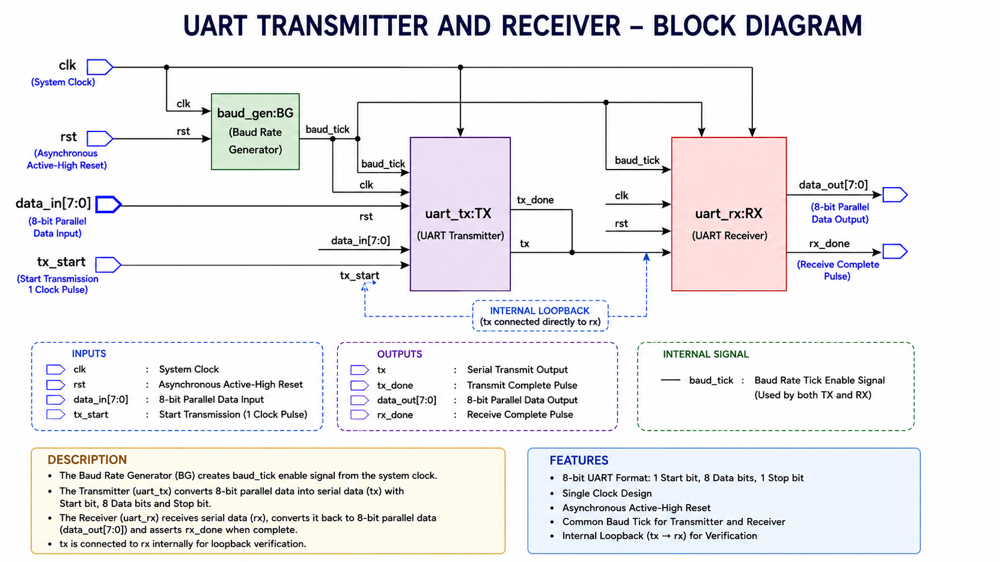
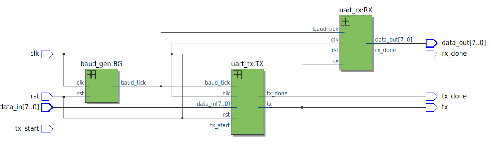

\# UART Transmitter and Receiver Design \& Verification


\## Overview


This project presents the design and functional verification of a Universal Asynchronous Receiver/Transmitter (UART) communication system using Verilog HDL. The design consists of a Baud Rate Generator, UART Transmitter, UART Receiver, and a Top Module integrating all submodules.

An internal loopback connection is implemented by connecting the transmitter output (`tx`) directly to the receiver input (`rx`) to verify successful serial communication without requiring external hardware.


\---

\## Project Objectives

\- Design a UART Transmitter using Verilog HDL.

\- Design a UART Receiver using Verilog HDL.

\- Generate the required baud rate using a Baud Rate Generator.

\- Verify serial data transmission and reception using ModelSim simulation.

\- Demonstrate successful loopback communication.


\---


\## Features

\- 8-bit UART communication

\- 1 Start Bit

\- 8 Data Bits

\- 1 Stop Bit

\- Baud Rate Generator

\- UART Transmitter FSM

\- UART Receiver FSM

\- Internal Loopback Verification

\- Functional Simulation using ModelSim

\- Modular Verilog Design


\---


\## Block Diagram




\---

\## RTL Block Diagram

The Quartus RTL Viewer shows the hierarchical implementation of the UART system.




\---

\## Project Structure

```text

UART-Transmitter-and-Receiver/

│

├── Block\_Diagram/

│   ├── UART\_Block\_Diagram.png

│   └── RTL\_Block\_Diagram.png

│

├── Source\_Code/

│   ├── baud\_gen.v

│   ├── uart\_tx.v

│   ├── uart\_rx.v

│   └── uart\_top.v

│

├── Testbench/

│   └── tb\_uart\_top.v

│

├── Quartus\_Project/

│   ├── baud\_gen.qpf

│   └── baud\_gen.qsf

│

├── Simulation\_Results/

│   └── UART\_Loopback\_Waveform.png

│

├── README.md

└── .gitignore

```


\---


\## Module Description

\### Baud Rate Generator (`baud\_gen.v`)

Generates the `baud\_tick` signal from the system clock to synchronize UART transmission and reception.

\### UART Transmitter (`uart\_tx.v`)

Receives 8-bit parallel data and converts it into serial data using the UART protocol. The transmitter operates through four FSM states:


\- IDLE

\- START

\- DATA

\- STOP


\### UART Receiver (`uart\_rx.v`)

Receives serial data from the transmitter, samples the incoming bits using the baud tick, reconstructs the original 8-bit data, and asserts `rx\_done` after successful reception.


\### Top Module (`uart\_top.v`)

Integrates the Baud Rate Generator, UART Transmitter, and UART Receiver. The transmitter output (`tx`) is internally connected to the receiver input (`rx`) for loopback verification.


\---

\## Simulation Results

The UART design was simulated using ModelSim.

Simulation verifies:

\- Successful transmission of serial data

\- Correct baud rate synchronization

\- Successful reception of transmitted data

\- Correct assertion of `tx\_done`

\- Correct assertion of `rx\_done`

\- Accurate reconstruction of received data (`data\_out`)


Example waveform:


\---


\## Tools Used


\- Verilog HDL

\- ModelSim

\- Intel Quartus Prime

\---


\## Future Improvements

\- Configurable Baud Rate

\- UART FIFO Buffer

\- Parity Bit Support

\- Variable Data Length

\- Hardware Implementation on FPGA

\---


\## Author

Darshan N S

Bachelor of Engineering (B.E.) – Electrical and Electronics Engineering (EEE)

Dayananda Sagar Academy of Technology and Management (DSATM), Bengaluru

